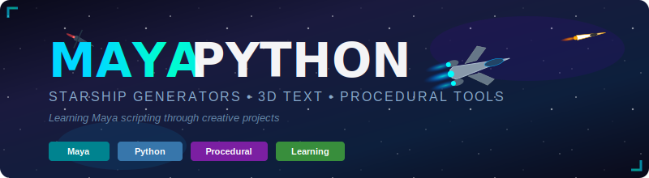

<p align="center">
  
</p>

<p align="center">
  <a href="#features"></a>
  <a href="#features"></a>
  
</p>

<p align="center">
  <b>🚀 Procedural starship generators and 3D tools for learning Maya Python scripting</b>
</p>

<p align="center">
  <i>Create infinite spaceship variations, 3D text, and more — perfect for beginners learning procedural content generation!</i>
</p>

---

## ✨ Features

- 🚀 **Starship Generators** - Create detailed 3D spaceships with one command (V1 & V2 with 6 themes!)
- ✏️ **3D Text Tools** - Extruded text with materials, bevels, and animations
- 🎬 **Animation Support** - Engine glow effects, hover, flyby, and banking maneuvers
- 🛸 **Squadron System** - Generate fleets in V-formation, diamond, line, or echelon
- 🖼️ **Built-in UIs** - Ready-to-use interface windows for all tools
- 📚 **Learning Focused** - Well-documented code designed for Maya Python beginners

## 📁 Project Structure

```
maya/
├── 📂 .github/instructions/ # Alex cognitive architecture (optional)
├── 📂 assets/               # Images and SVG resources
│   ├── banner.svg
│   └── hello-world-3d.svg
├── 📂 domain-knowledge/     # Documentation and references
├── 📂 launchers/            # Easy-to-use launcher scripts
│   ├── RUN_STARSHIP_V1.py   # Starship V1 launcher
│   ├── RUN_STARSHIP_V2.py   # Starship V2 launcher
│   ├── RUN_STARWARS_FLEET.py # ⭐ Star Wars Fleet launcher
│   ├── RUN_MINECRAFT.py     # 🟫 Minecraft Characters launcher
│   ├── RUN_3D_TEXT.py       # 3D Text V2 launcher
│   ├── RUN_3D_TEXT_V1.py    # 3D Text V1 launcher
│   ├── RUN_FONT_DIAGNOSTIC.py # Font troubleshooting
│   └── RUN_IN_MAYA.py       # Quick launcher (Starship V1)
├── 📂 scripts/              # Main Python scripts
│   ├── starship.py          # Starship Generator V1
│   ├── starship_v2.py       # Starship Generator V2 (Advanced)
│   ├── starwars_fleet.py    # ⭐ Star Wars Inspired Fleet Generator
│   ├── minecraft_characters.py # 🟫 Minecraft Character Generator
│   ├── fancy_3d_text.py     # 3D Text V1 (textCurves)
│   ├── fancy_3d_text_v2.py  # 3D Text V2 (Type tool)
│   └── font_diagnostic.py   # Font troubleshooting utility
├── .gitignore
├── HOW_TO_RUN_SCRIPTS.md    # Detailed running instructions
└── README.md
```

## 🚀 Quick Start

### Installation

1. **Clone or download** this repository
2. **Add to Maya's script path** in `userSetup.py`:

```python
import sys
sys.path.insert(0, r"C:\Development\maya\scripts")
```

3. **Restart Maya** or reload scripts

### Running Scripts

**Option 1: Import in Maya**
```python
import starship
starship.show_ui()
```

**Option 2: Execute launcher file**
```python
# Starship V1
exec(open(r"C:\Development\maya\launchers\RUN_STARSHIP_V1.py").read())

# Starship V2 (advanced)
exec(open(r"C:\Development\maya\launchers\RUN_STARSHIP_V2.py").read())

# 3D Text
exec(open(r"C:\Development\maya\launchers\RUN_3D_TEXT.py").read())
```

## 📖 Documentation

See the [domain-knowledge](domain-knowledge/) folder for comprehensive guides:

- [Maya Python Scripting Guide](domain-knowledge/DK-MAYA-PYTHON-SCRIPTING-v1.0.0.md) - Complete reference

## 🛠️ Development Setup

### IDE Support with maya-stubs

For better code editing with autocomplete (outside of Maya):

```bash
pip install maya-stubs
```

This provides type hints for `maya.cmds` and `maya.mel` in VS Code/PyCharm.

> **Note:** Scripts must still be run inside Maya - stubs only provide autocomplete.

## 🚀 Available Scripts

### 🛸 Starship Generator V1 (`scripts/starship.py`)

A fun script that creates detailed 3D starships using only primitive shapes!

**Quick Start:**
```python
# In Maya Script Editor (Python tab):
exec(open(r"C:\Development\maya\launchers\RUN_STARSHIP_V1.py").read())
```

**Functions:**

| Function | Description |
|----------|-------------|
| `create_starship(name, ship_type, color_scheme, scale, add_animation)` | Create a single starship |
| `create_fleet(count, formation)` | Create a fleet of ships in formation |
| `show_ui()` | Open the interactive UI window |

**Parameters for `create_starship()`:**

| Parameter | Type | Default | Description |
|-----------|------|---------|-------------|
| `name` | str | `"starship"` | Name for the ship group |
| `ship_type` | str | `"fighter"` | Ship class: `"fighter"`, `"scout"`, `"bomber"`, `"cruiser"` |
| `color_scheme` | str | `"classic"` | Colors: `"classic"`, `"rebel"`, `"imperial"`, `"pirate"`, `"alien"` |
| `scale` | float | `1.0` | Size multiplier (0.5 - 3.0) |
| `add_animation` | bool | `True` | Add engine glow animation |

**Examples:**
```python
import starship

# Create different ships
starship.create_starship("x_wing", "fighter", "rebel")
starship.create_starship("tie", "scout", "imperial", scale=0.8)
starship.create_starship("bomber_1", "bomber", "pirate", scale=1.5)

# Create a fleet (formations: "line", "v", "diamond", "random")
starship.create_fleet(5, "v")

# Open the UI
starship.show_ui()
```

---

### 🚀 Starship Generator V2 (`scripts/starship_v2.py`)

**Advanced Edition** with more detailed ships, new classes, and squadron support!

**Quick Start:**
```python
# In Maya Script Editor (Python tab):
exec(open(r"C:\Development\maya\launchers\RUN_STARSHIP_V2.py").read())
```

**Functions:**

| Function | Description |
|----------|-------------|
| `create_starship(name, ship_class, theme, scale, add_animation, animation_style)` | Create a detailed starship |
| `create_squadron(count, ship_class, theme, formation)` | Create a squadron in formation |
| `show_ui()` | Open the advanced UI window |

**Parameters for `create_starship()`:**

| Parameter | Type | Default | Options |
|-----------|------|---------|---------|
| `name` | str | `"starship"` | Any string for the ship's name |
| `ship_class` | str | `"interceptor"` | `"interceptor"`, `"heavy_fighter"`, `"racer"` |
| `theme` | str | `"federation"` | `"federation"`, `"empire"`, `"bounty_hunter"`, `"alien"`, `"stealth"`, `"racer"` |
| `scale` | float | `1.0` | Size multiplier (0.5 - 3.0) |
| `add_animation` | bool | `True` | Add flight animations |
| `animation_style` | str | `"hover"` | `"hover"`, `"flyby"`, `"banking"` |

**Ship Classes:**

| Class | Description | Parts |
|-------|-------------|-------|
| 🔹 **Interceptor** | Fast & agile with forward-swept wings | ~40 |
| 🔸 **Heavy Fighter** | Armored with triple engines & weapons | ~45 |
| ⚡ **Racer** | Minimal armor, massive engines | ~35 |

**Color Themes:**

| Theme | Colors | Style |
|-------|--------|-------|
| 🔵 **Federation** | Silver, blue, cyan glow | Hero/Alliance ships |
| ⚫ **Empire** | Dark gray, black, red glow | Villain ships |
| 🟤 **Bounty Hunter** | Worn brown, gold, orange | Mercenary aesthetic |
| 🟢 **Alien** | Dark green, purple, green glow | Organic/bio-tech |
| ⬛ **Stealth** | Black, dark gray, dim blue | Covert ops |
| ⚪ **Racer** | White, orange, bright cyan | Speed machines |

**Parameters for `create_squadron()`:**

| Parameter | Type | Default | Options |
|-----------|------|---------|---------|
| `count` | int | `3` | Number of ships (1-12) |
| `ship_class` | str | `"interceptor"` | Same as `create_starship` |
| `theme` | str | `"federation"` | Same as `create_starship` |
| `formation` | str | `"v"` | `"v"`, `"line"`, `"diamond"`, `"echelon"` |

**Examples:**
```python
import starship_v2

# Create individual ships
starship_v2.create_starship("red_five", "interceptor", "federation")
starship_v2.create_starship("tie_advanced", "interceptor", "empire", scale=0.9)
starship_v2.create_starship("slave_one", "heavy_fighter", "bounty_hunter")
starship_v2.create_starship("bio_cruiser", "interceptor", "alien", scale=1.3)
starship_v2.create_starship("phantom", "interceptor", "stealth")
starship_v2.create_starship("speed_demon", "racer", "racer")

# Create squadrons
starship_v2.create_squadron(5, "interceptor", "federation", "v")
starship_v2.create_squadron(4, "heavy_fighter", "empire", "diamond")
starship_v2.create_squadron(3, "racer", "racer", "line")

# Open the UI
starship_v2.show_ui()
```

---

### ⭐ Star Wars Fleet Generator (`scripts/starwars_fleet.py`)

Create iconic Star Wars-inspired starships and fleets!

**Quick Start:**
```python
exec(open(r"C:\Development\maya\launchers\RUN_STARWARS_FLEET.py").read())
```

**Functions:**

| Function | Description |
|----------|-------------|
| `create_ship(ship_type, name, scale, position)` | Create a single iconic ship |
| `create_fleet(faction, count, formation)` | Create a faction fleet |
| `show_ui()` | Open the Star Wars UI |

**Available Ships:**

| Ship | Faction | Description |
|------|---------|-------------|
| 🔴 `xwing` | Rebel | X-Wing Fighter with S-foils |
| 🟡 `ywing` | Rebel | Y-Wing Bomber with exposed engines |
| 🔴 `awing` | Rebel | A-Wing Interceptor (fast & red) |
| ⚪ `falcon` | Rebel | Light Freighter (YT-1300 style) |
| ⬛ `tie` | Imperial | TIE Fighter with hexagonal wings |
| ⬛ `interceptor` | Imperial | TIE Interceptor with dagger wings |
| ⬜ `shuttle` | Imperial | Lambda-class with folding wings |
| 🟢 `slave1` | Bounty Hunter | Firespray Gunship |

**Fleet Formations:**

| Formation | Description |
|-----------|-------------|
| `attack` | V-formation (lead ship at front) |
| `patrol` | Horizontal line |
| `escort` | Diamond pattern around center |

**Examples:**
```python
import starwars_fleet

# Create individual ships
starwars_fleet.create_ship("xwing")
starwars_fleet.create_ship("tie", scale=1.5)
starwars_fleet.create_ship("falcon", position=(10, 0, 0))

# Create fleets
starwars_fleet.create_fleet("rebel", count=5, formation="attack")
starwars_fleet.create_fleet("imperial", count=8, formation="patrol")

# Epic battle scene!
starwars_fleet.create_fleet("rebel", count=5)
starwars_fleet.create_fleet("imperial", count=7)

# Open the UI
starwars_fleet.show_ui()
```

---

### 🟫 Minecraft Character Generator (`scripts/minecraft_characters.py`)

Create blocky voxel-style Minecraft characters with equipment and poses!

**Quick Start:**
```python
exec(open(r"C:\Development\maya\launchers\RUN_MINECRAFT.py").read())
```

**Functions:**

| Function | Description |
|----------|-------------|
| `create_character(char_type, name, scale, pose, held_item, armor)` | Create any character |
| `create_village(character_count, radius)` | Create a village scene |
| `create_mob_horde(mob_type, count, formation)` | Create hostile mob group |
| `show_ui()` | Open the character generator UI |

**Available Characters:**

| Character | Type | Description |
|-----------|------|-------------|
| 👤 `steve` | Player | Classic player - cyan shirt, blue jeans |
| 👩 `alex` | Player | Alternate player - green shirt, orange hair |
| 🧟 `zombie` | Hostile | Green undead mob |
| 💀 `skeleton` | Hostile | Bone archer (give it a bow!) |
| 💚 `creeper` | Hostile | Explosive green mob with iconic face |
| 👁️ `enderman` | Hostile | Tall dark mob with purple eyes |
| 🧙 `witch` | Hostile | Purple-robed with pointy hat |
| 👃 `villager` | Friendly | NPC trader with big nose |
| 🐷 `pigman` | Neutral | Zombie Piglin from the Nether |
| 🤖 `iron_golem` | Friendly | Large village protector |

**Equipment Options:**

| Category | Options |
|----------|---------|
| **Poses** | `standing`, `walking`, `wave`, `zombie` |
| **Held Items** | `sword` (diamond), `pickaxe` (iron), `bow` |
| **Armor** | `leather`, `chainmail`, `iron`, `gold`, `diamond`, `netherite` |

**Examples:**
```python
import minecraft_characters

# Create characters
minecraft_characters.create_character("steve")
minecraft_characters.create_character("alex", pose="wave")
minecraft_characters.create_character("zombie", pose="zombie")
minecraft_characters.create_character("skeleton", held_item="bow")
minecraft_characters.create_character("steve", armor="diamond", held_item="sword")

# Create groups
minecraft_characters.create_village(8)  # 8 characters in a circle
minecraft_characters.create_mob_horde("zombie", count=10)  # Zombie swarm!
minecraft_characters.create_mob_horde("creeper", count=6, formation="ambush")

# Open the UI
minecraft_characters.show_ui()
```

---

### ✏️ 3D Text Generator (`scripts/fancy_3d_text_v2.py`)

Creates extruded 3D text with materials and bevels using Maya's Type tool.

> ⚠️ **Note:** May show default "3D Type" text due to Maya font handling. Works best for learning the Type tool API.

**Quick Start:**
```python
exec(open(r"C:\Development\maya\launchers\RUN_3D_TEXT.py").read())
```

**Functions:**

| Function | Description |
|----------|-------------|
| `create_3d_text(text, color_preset, extrude_depth, ...)` | Create 3D text geometry |
| `show_ui()` | Open the text creator UI |

**Parameters for `create_3d_text()`:**

| Parameter | Type | Default | Description |
|-----------|------|---------|-------------|
| `text` | str | `"HELLO WORLD"` | Text to create |
| `color_preset` | str | `"rainbow"` | Colors: `"rainbow"`, `"fire"`, `"ocean"`, `"neon"`, `"gold"`, `"forest"` |
| `extrude_depth` | float | `0.5` | Depth of 3D extrusion |
| `bevel_depth` | float | `0.05` | Bevel size for edges |
| `add_glow` | bool | `True` | Add glowing effect |
| `animation_type` | str | `"wave"` | Animation: `"wave"`, `"bounce"`, `"spin"`, `"pop"` |

---

### 🔧 Font Diagnostic (`scripts/font_diagnostic.py`)

Utility to troubleshoot Maya font issues and find available fonts.

```python
import font_diagnostic
font_diagnostic.diagnose_fonts()
```

---

## 📂 Launcher Scripts

For convenience, use these launcher scripts in Maya's Script Editor (located in `launchers/` folder):

| Launcher | Script | Description |
|----------|--------|-------------|
| `RUN_STARSHIP_V1.py` | starship.py | Starship Generator V1 with full documentation |
| `RUN_STARSHIP_V2.py` | starship_v2.py | Starship Generator V2 (Advanced) |
| `RUN_3D_TEXT.py` | fancy_3d_text_v2.py | 3D Text Creator V2 (Type tool) |
| `RUN_3D_TEXT_V1.py` | fancy_3d_text.py | 3D Text Creator V1 (textCurves) |
| `RUN_FONT_DIAGNOSTIC.py` | font_diagnostic.py | Font troubleshooting utility |
| `RUN_IN_MAYA.py` | starship.py | Quick launcher for Starship V1 |

**How to use:**
1. Open the launcher file in a text editor
2. Copy everything below the dashed line
3. Paste into Maya's Script Editor (Python tab)
4. Press `Ctrl+Enter` to execute

Each launcher includes:
- Full function signatures with all parameters
- Usage examples and options reference
- Type hints and return values

---

## 🎯 Additional Examples

### Create Objects with Automation

```python
import maya.cmds as cmds

def create_grid(rows=5, cols=5, spacing=2):
    """Create a grid of spheres."""
    for i in range(rows):
        for j in range(cols):
            sphere = cmds.polySphere(r=0.5, name=f"sphere_{i}_{j}")[0]
            cmds.move(i * spacing, 0, j * spacing, sphere)
```

### Build a Simple UI Tool

```python
import maya.cmds as cmds

def show_quick_tool():
    if cmds.window("quickTool", exists=True):
        cmds.deleteUI("quickTool")

    win = cmds.window("quickTool", title="Quick Tool", wh=(250, 100))
    cmds.columnLayout(adj=True, rs=5)
    cmds.button(label="Create Locator", c=lambda x: cmds.spaceLocator())
    cmds.button(label="Delete Selected", c=lambda x: cmds.delete())
    cmds.showWindow(win)
```

## 🤝 Contributing

1. Fork the repository
2. Create a feature branch (`git checkout -b feature/amazing-tool`)
3. Commit your changes (`git commit -m 'Add amazing tool'`)
4. Push to the branch (`git push origin feature/amazing-tool`)
5. Open a Pull Request

## 📜 License

This project is licensed under the MIT License.

---

<p align="center">
  Made with ❤️ for Maya artists and TDs
</p>
